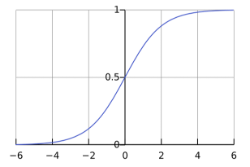
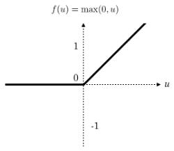
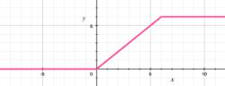
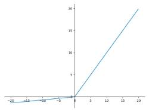
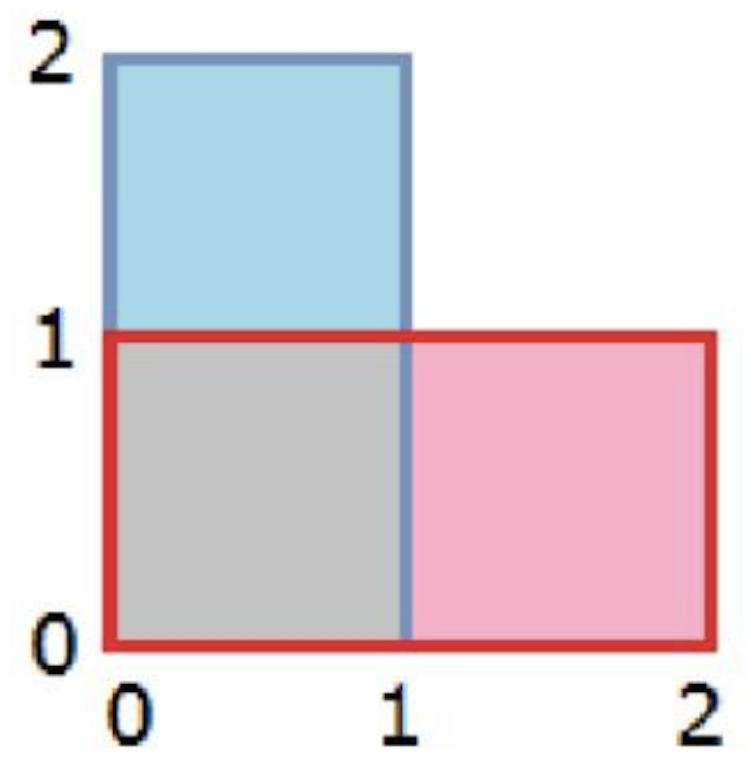
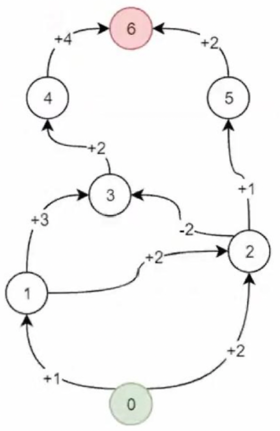

# Tests 
> You have 15 minutes to complete the questions when you start)
## Syllabus

## Test_deepNN
> Number of questions in the test: 6

### What is computed by a neuron?
- [x] a linear function (`z = Wx + b`) **followed by an activation function**
- [ ] the mean of all features before applying the output to an activation function
- [ ] a function g that scales the input x linearly (`Wx + b`)
- [ ] an activation function followed by a linear function (`z = Wx + b`)

### Correlation task
| Activation func | Plot                    |
|:---------------:|:------------------------|
|     Sigmoid     |  |
|      ReLU       |     |
|      ReLU6      |    |
|    LeakyReLU    |      |

### Which of the following is sigmoid implementation in PyTorch?
- [x] function `torch.nn.functional.sigmoid`
- [ ] is passed as a parameter of linear modules `torch.nn.Linear(activation='sigmoid')`
- [x] module `torch.nn.Sigmoid`
- [ ] there is no sigmoid in PyTorch

### What is stochastic gradient descent?
- [x] Updating the weights of the network using **only one element** from the dataset in a timestep
- [ ] It is an approach that was introduces by prof. Joseph Stochastic
- [ ] Updating the weights of the network using only a random subset of elements from the dataset in a timestep
- [ ] Stochastically selecting learning rate during the training

### What problem can be overcome with dropout regularization?
- [x] **high variance**
- [ ] low bias
- [ ] high bias
- [ ] low variance


## Test_deepNN_2
### What is true about convolutions? 
- [x] Convolution is a differentiable operation 
- [ ] The best amount of kernels for convolutional layer is 10 
- [x] Coefficients of the convolution can be learned with backpropagation 
- [ ] Coefficients of the convolution must be defined by the user 

### What is true about convolution and cross-correlation? 
- [x] In convolution, the kernel is flipped
- [ ] In cross-correlation, the kernel is flipped
- [ ] Actual implementations of neural networks use convolutions 

### What is the reason of max/min/global pooling operant in neural networks? 
- [x] Reduce tensor size
- [x] Noise filtering
- [ ] Find maximum on the whole tensor 
- [x] Local connectivity of tensor elements

### How to deal with multiobject detection in images? 
- [x] Anchors
- [x] Processing with windows
- [ ] Multiple NN for each object
- [ ] No way to do that

### Calculate IoU

- [ ] 0
- [ ] 1/2
- [x] 1/3
- [ ] 2/3
- [ ] 3/4

## Test_deepNN_3
### Which NN layers can be used to process textual data?
- [x] Recurrent Neural Network
- [x] Linear
- [x] Convolutional NN

### Select machine translation quality metrics 
- [x] BLEU
- [ ] Coherence
- [ ] Weighted RAU
- [x] ROUGE

### Which of the roaming similarity measures have trainable weights? 
- [ ] Scalar multiplication
- [x] Additive Attention
- [x] Multiplicative Attention
- [ ] None or tne above

### Attention mechanism in seq2seq models 
- [ ] Does not affect the computational complexity of the network
- [x] Increases the computational complexity or the network 
- [ ] Decreases the computational complexity or the network

### Attention layer in encoder-decoder architecture is applied 
- [ ] After the Decoder has finished processing the input sequence
- [x] While the Decoder is processing the input sequence
- [ ] While the Encoder Is processing the input sequence

### What is the size of hidden in the example below? 
```python
lstm = nn.LSTM(
    input_size=3, hidden_size=3, num_layers=1, 
    bias=True, batch_first=False, bidirectional=False
) 
out, hidden = lstm(input, hidden)
```

- [ ] ``[1x1x6, 1x1x6]``
- [x] ``[1x1x3, 1x1x3]``
- [ ] ``1x1x3``
- [ ] ``1x1x6``
- [ ] ``[1x1x3, 1x1x3, 1x1x3]``
- [ ] No right answer

## Test_deepNN_4
### Which of the following is not an example of generative models? 
- [ ] Variational Auto encoders
- [x] Discriminator models
- [ ] GAN models
- [ ] Diffusion models 
- [ ] Flow-based models
- [x] CNN 

### Which of the following statements are true for the VAE objective? 
- [ ] The gap between the VAE objective and the maximum likelihood objective is `KL[p(z)||q(z|x)]`
- [x] It is a lower-bound to the maximum likelihood objective
- [ ] The KL term can always be viewed as a regulariser for the VAE encoder
- [ ] The optimum of the VAE decoder is also the MLE optimum 


### If we represent GAN Generator as `G(z; theta_g)`, the following statements are true? 
- [ ] p_z(z) represents probability distribution of data
- [x] input noise is sampled from domain z
- [x] theta_g represents parameters of generator model
- [] theta_g represents parameters of discriminator model 


### Which of the statements describe advantages of GAN models? 
- [x] Conditioning can be created by adding an input to both G and D 
- [ ] Sampling requires Markov chain
- [ ] Semi-supervised learning, when limited data available for classifiers
- [ ] Training can be done easily by doing back propagation 

### Which statements are true about diffusion models? 
- [x] In forward diffusion process, small amount of Gaussian noise is added to the sample for T steps
- [ ] In reverse diffusion process, small amount of Gaussian noise is added to the sample for T steps
- [ ] Latent variable has lower dimensionality than the original data


## Test_deepNN_5
### Elements of Reinforcement Learning
- [x] Value function
- [ ] Cost function
- [x] Policy
- [x] Reward
- [ ] Expected outcome
- [x] Environment
- [x] Agent

### What is the difference between on-policy and off-policy algorithms? 
- [x] For on-policy algorithms, data should be sampled from the current policy and for off-policy — data can be sampled from different policies 
- [ ] For off-policy algorithms, data should be sampled from the current policy and for on-policy — data can be sampled from different policies 

### Why Target-network is needed in DQN? 
- [x] To stabilize the training process 
- [ ] Target-network prevents overfilling 
- [ ] This is an only way to calculate MSE 

### What is Advantage? 
- [x] Q-function — Value function
- [ ] Q-function + Value function 
- [ ] Q-function / Value function
- [ ] Q-function * Value function 

### Why prioritized experience replay is used in RL 
- [ ] To train more on examples with the lowest error
- [x] To train more on examples with the highest error 
- [x] To speed up training
- [ ] To train more efficiently 

### You have an environment represented as a graph. In this environment, states are nodes of the graph and actions — directed transitions between the nodes. Agent is starting his way from the 0 node (green) and finishes at 6 (red). Calculate the value function result for the node 2. Discounting coefficient gamma is equal to 1. 


- [x] 4
> Comment: optimal policy will select the way with the highest reward, which is 2 -> 3 -> 4 where reward is 4 


### Discounting coefficient is .. 
- [x] A way to increase the weight of short-term reward
- [ ] A special coefficient to model retail environments
- [x] A component to model optimal strategy 